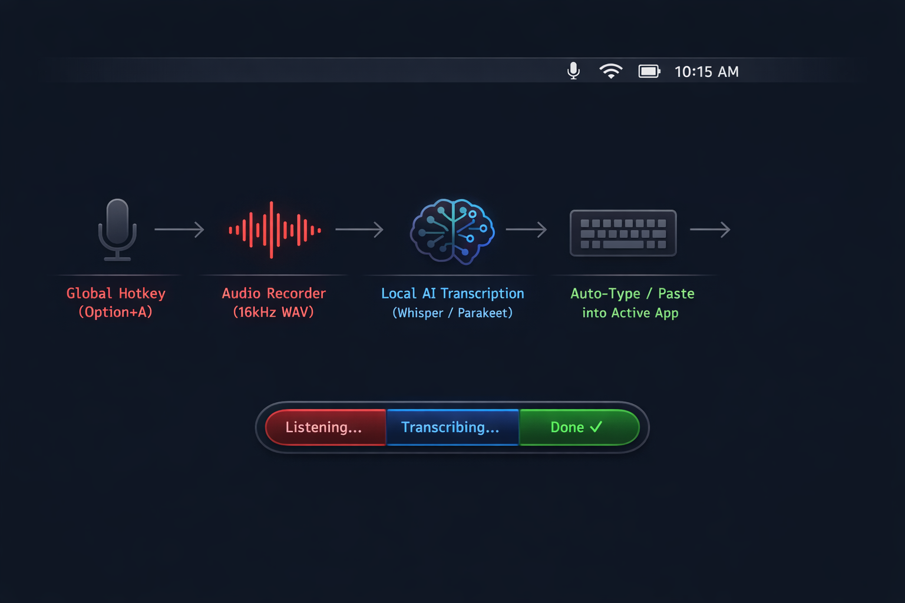
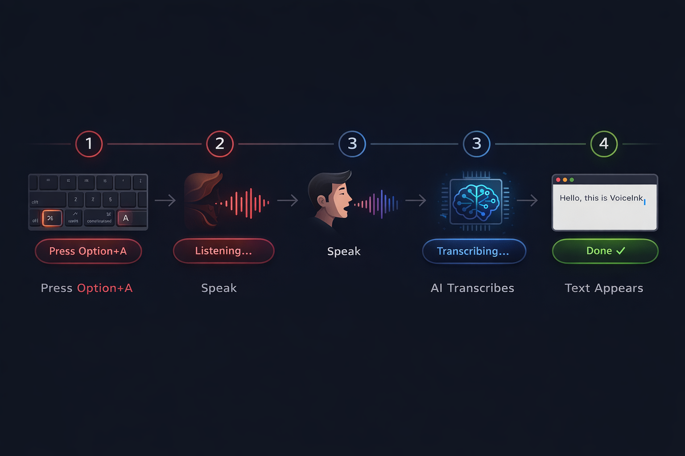
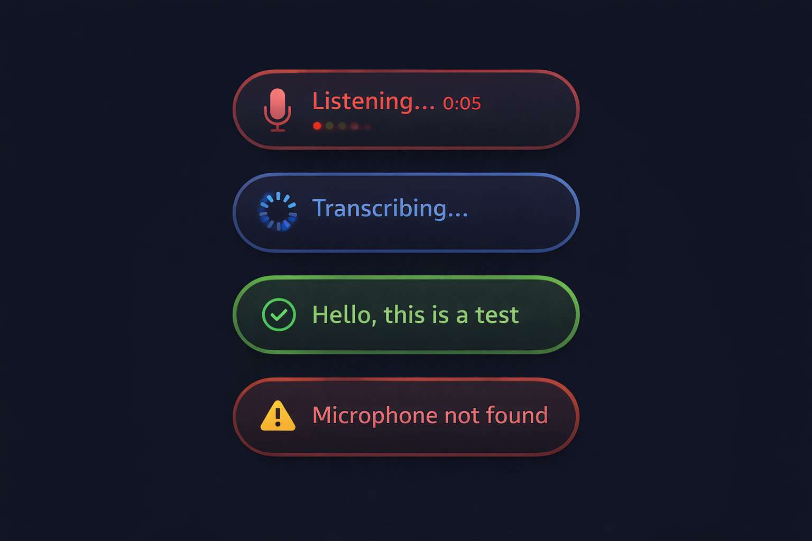

# VoiceInk

Local speech-to-text for macOS, built on [NVIDIA Parakeet](https://huggingface.co/mlx-community/parakeet-tdt-0.6b-v2) and Apple's [MLX](https://github.com/ml-explore/mlx) framework. Runs on-device. No API keys, no cloud, no subscriptions.



## Why

If you're paying for a speech-to-text API (Whisper, Google Cloud Speech, etc.), you can stop. Parakeet-TDT 0.6B runs locally on Apple Silicon, transcribes faster than real-time, and the output quality is solid for English.

VoiceInk wraps it in a menu bar app with a global hotkey. Press `Option+A`, talk, press `Option+A` again. Transcribed text shows up wherever your cursor is.

## How it works



VoiceInk sits in your menu bar. When you press the hotkey, it records from your mic and passes the audio to a Python script (`transcribe.py`) that runs Parakeet through MLX, Apple's ML framework for M-series chips. The transcribed text gets pasted at your cursor position.

Nothing leaves your machine. The model (~1.2 GB) downloads once during setup and gets cached locally. After that, it works offline.

## Requirements

- macOS 14 (Sonoma) or later
- Apple Silicon (M1, M2, M3, M4)
- A microphone (MacBooks have one built-in; Mac Mini / Studio / Pro need an external mic)
- ~2 GB of disk space
- Internet for initial setup only

## Setup

### 1. Clone the repo

```bash
git clone https://github.com/aulakhs/VoiceInk.git
cd VoiceInk
```

### 2. Download VoiceInk.app

I'll share the `VoiceInk.app.zip` download link with you directly. Once you have it, download the zip and drop it into the `VoiceInk` folder you just cloned.

> The app binary isn't in this repo because it's a compiled macOS bundle, not something that belongs in Git.

### 3. Run the setup script

```bash
bash setup.sh
```

It installs Homebrew, Python 3.13, sets up a virtual environment with parakeet-mlx, places the files where they need to be, and downloads the ML model. Takes 5-15 minutes depending on your connection.

If something fails, run it again. It picks up where it left off.

### 4. First launch

The app isn't signed with an Apple Developer certificate ($99/year, not worth it for this), so macOS will block a normal double-click. To get around Gatekeeper:

1. Open Finder and go to `~/Applications`
2. **Right-click** VoiceInk.app and click **Open**
3. macOS will warn you about an unidentified developer. Click **Open**.

You only need to do this once.

### 5. Grant permissions

VoiceInk needs three permissions. macOS will prompt for each on first launch.

| Permission | What it's for | Where to enable |
|---|---|---|
| Accessibility | Pasting transcribed text at your cursor | System Settings > Privacy & Security > Accessibility |
| Input Monitoring | Detecting the `Option+A` hotkey globally | System Settings > Privacy & Security > Input Monitoring |
| Microphone | Recording audio | System Settings > Privacy & Security > Microphone |

Toggle VoiceInk **on** for each one. If you don't get a prompt, add it manually from the locations above.

Restart VoiceInk after granting permissions (quit from the menu bar icon, then reopen).

## Usage

1. Put your cursor where you want the text to go
2. Press **`Option + A`** to start recording
3. Speak
4. Press **`Option + A`** again to stop
5. Transcribed text appears at your cursor

A small floating pill shows the current state:



| Pill state | Meaning |
|---|---|
| Red / pulsing | Recording, speak now |
| Processing | Transcribing your audio |
| Done | Text has been pasted |
| Error | Something went wrong (check permissions) |

### Output modes

| Mode | What it does |
|---|---|
| Smart | Pastes with punctuation and formatting |
| Paste | Pastes the raw transcription |
| Paste + Enter | Pastes and presses Enter. Good for Spotlight, chat apps, terminal |

## Disk footprint

| Component | Size |
|---|---|
| VoiceInk.app | ~5 MB |
| Python environment + dependencies | ~600 MB |
| Parakeet model (cached) | ~1.2 GB |
| **Total** | **~1.8 GB** |

## Limitations

- English only
- Apple Silicon only (MLX requires M-series chips)
- Not signed, so you need the right-click bypass on first launch
- Longer recordings take proportionally longer to transcribe
- First transcription after a reboot takes a few seconds while the model loads into memory

## Troubleshooting

| Problem | Fix |
|---|---|
| macOS says the app "can't be opened" | Right-click > Open. See [First launch](#4-first-launch) |
| `Option+A` doesn't do anything | Grant Input Monitoring, restart VoiceInk |
| Records but text doesn't appear | Grant Accessibility, restart VoiceInk |
| No audio detected | Grant Microphone. Mac Mini/Studio/Pro users need an external mic |
| First transcription is slow | Normal after a reboot. The model loads into memory on first use (~5s) |
| App quits immediately on launch | Run from Terminal to see the error: `~/Applications/VoiceInk.app/Contents/MacOS/VoiceInk` |
| `setup.sh` fails partway through | Check your internet and run it again. It skips completed steps |

## Uninstall

Run `bash setup.sh --uninstall` or manually remove:

```bash
rm -rf ~/Applications/VoiceInk.app
rm -rf ~/.cache/huggingface/hub/models--mlx-community--parakeet-tdt-0.6b-v2
```

The setup script will also clean up the Python environment it created.

If you added VoiceInk to Login Items: System Settings > General > Login Items > remove it.

## Source code

The native app is a Swift Package (no Xcode project required):

```
Sources/VoiceInk/
├── main.swift                 # Entry point
├── AppDelegate.swift          # Orchestrates the full lifecycle
├── AppState.swift             # State machine (idle → recording → transcribing → done)
├── HotkeyManager.swift        # CGEventTap for global Option+A detection
├── AudioRecorder.swift        # AVAudioRecorder → 16kHz mono WAV
├── TranscriptionService.swift # Spawns Python subprocess for Parakeet
├── TextOutputService.swift    # Clipboard + CGEvent keyboard injection
├── FloatingPillWindow.swift   # NSPanel overlay (click-through, visible across all Spaces)
├── PillView.swift             # SwiftUI pill with animated state indicators
├── MenuBarController.swift    # Status bar menu and settings
└── PermissionChecker.swift    # Accessibility + Microphone permission flow
```

To build from source:

```bash
swift build -c release
```

Or use the included scripts:

```bash
./Scripts/build.sh      # Build release binary
./Scripts/install.sh    # Build + create ~/Applications/VoiceInk.app
```

## License

MIT
